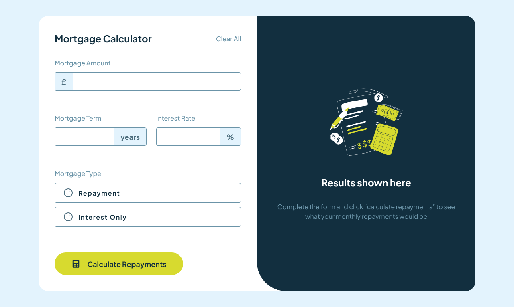

# Frontend Mentor - Mortgage repayment calculator

## Welcome! 👋

Thanks for checking out this front-end coding challenge.

[Frontend Mentor](https://www.frontendmentor.io) challenges help you improve your coding skills by building realistic projects.

**To do this challenge, you need a basic understanding of HTML, CSS and JavaScript.**

## The challenge

Your challenge is to build out this mortgage repayment calculator and get it looking as close to the design as possible.

You can use any tools you like to help you complete the challenge. So if you've got something you'd like to practice, feel free to give it a go.

Your users should be able to:

- Input mortgage information and see monthly repayment and total repayment amounts after submitting the form
- See form validation messages if any field is incomplete
- Complete the form only using their keyboard
- View the optimal layout for the interface depending on their device's screen size
- See hover and focus states for all interactive elements on the page

Want some support on the challenge? [Join our community](https://www.frontendmentor.io/community) and ask questions in the **#help** channel.

### Screenshot

### Links

- Solution URL:[Frontend Mentor](https://github.com/aars-dev/frontendmentor-challenges/tree/master/mortgage-repayment-calculator-main)
- Live Site URL:[Live URL](https://aars-dev.github.io/frontendmentor-challenges/mortgage-repayment-calculator-main/src/index.html)

## My process

### Built with

- Semantic HTML5 markup
- CSS custom properties
- Flexbox
- CSS Grid
- Mobile-first workflow
- [Tailwind CSS](https://tailwindcss.com/) - For styles

## Author

- GitHub - [aars-dev](https://github.com/aars-dev)
- Frontend Mentor - [aars-dev](https://www.frontendmentor.io/profile/aars-dev)
